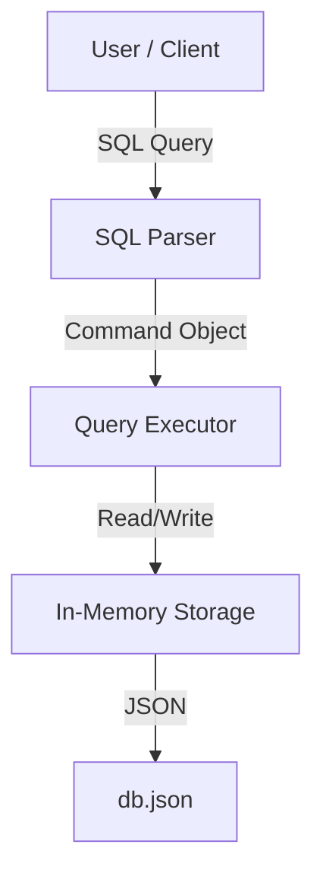

# System Architecture

## High-Level Overview

The Pesapal RDBMS is an **In-Memory, Document-Oriented Relational Database**. It mimics standard SQL behavior but stores data as JSON-serializable Python objects.

## Detailed Components

### 1. Storage Layer (`src/db/`)
- **Tables**: Stored as a Dictionary of `Table` objects.
- **Rows**: List of Dictionaries `[{col: val}, ...]`. 
- **Indexes**: Separate Hash Maps (`dict`) for `PRIMARY KEY` and `UNIQUE` constraints.
  - *Benefit*: `SELECT * FROM users WHERE id=1` is O(1) instead of O(N).

### 2. Parsing Layer (`src/parser/`)
The parser does not use a full grammar tree (AST) for simplicity. Instead, it uses **Regex Matching** to identify command types (`SELECT`, `INSERT`, etc.) and extract clauses (`WHERE`, `VALUES`, `JOIN`, `ON`).

### 3. Interface Layer
- **REPL**: Uses Python's `cmd` loop. It loads the DB on startup and saves on exit.
- **Web API**: A REST interface where `POST /api/query` accepts a raw SQL string and returns a JSON result set.

## Persistence Model
The database is **ACID-lite**:
- **A**tomicity: Individual commands fail completely or succeed.
- **C**onsistency: Type and Unique checks are enforced before write.
- **I**solation: Single-threaded (Python GIL), essentially serializable.
- **D**urability: Snapshot-based. Data is written to disk on specific checkpoints (REPL exit or Web API Write).
